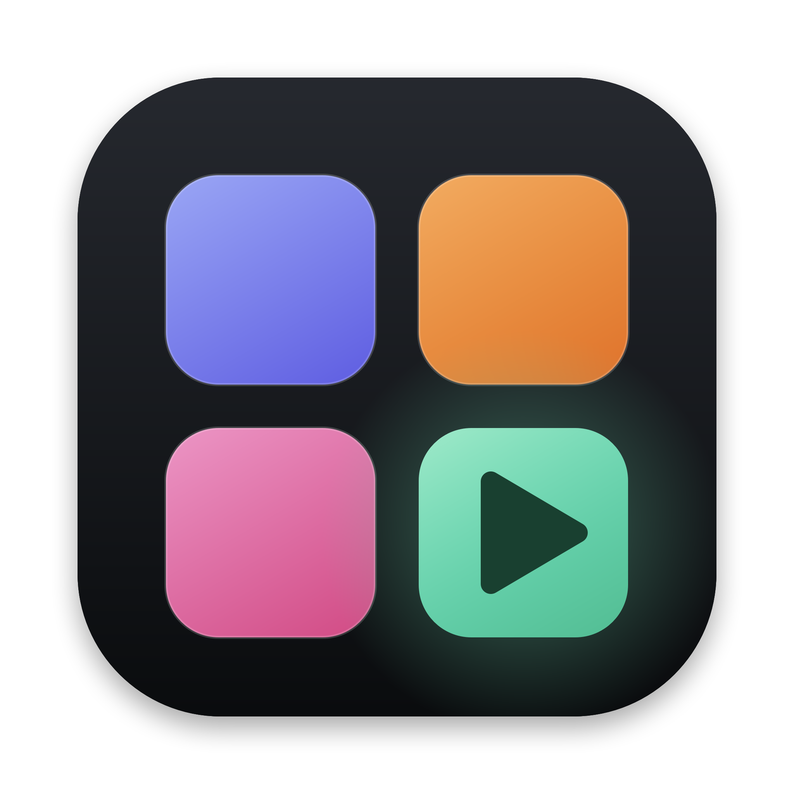

# Run Local

All your local projects in one grid, with their icons. Click one to start it and open it in the browser. For macOS.



[Türkçe](#türkçe)

## Install

Requires macOS and [Node.js](https://nodejs.org) 18+.

```sh
git clone https://github.com/hsynozdamar-byte/run-local.git ~/Developer/run-local
~/Developer/run-local/install.sh
```

A **Run Local** app appears on your Desktop. Double-click it.

## What it does

- Scans common project folders like `~/Developer`, `~/Projects` and `~/code`, two levels deep.
- Recognizes Next, Vite, Remotion, Node (`dev` or `start` script), static `index.html` sites and Xcode projects.
- Picks npm, pnpm or bun from the lockfile, and installs packages first if they are missing.
- Shows servers started elsewhere too. Stop kills the whole process tree.
- ⋯ menu: show in folder, open in editor, log, rename, hide, refresh, move to group.
- Groups work like folders on a phone: drop a project on the middle of another to make a folder, drop it on a folder to add it. Click a folder and it grows open from its tile; drag a project out to remove it.
- Drop a tile on another tile's edge to reorder. Folders move too.
- Video (Remotion) projects get a play badge on their icon.
- **Settings**: language (English / Türkçe), scanned folders and hidden projects.
- When the panel code is updated, a "Restart" banner appears. Running servers stop and come back on their own.

## Settings file

`state.json` is created on first run and is not committed.

```json
{
  "roots": ["/Users/you/Developer"],
  "extra": ["/Users/you/Downloads/single-project"],
  "hidden": [],
  "names": { "~/Developer/my-app": "My App" },
  "groups": [{ "id": "a1", "name": "Client work", "collapsed": false, "items": ["~/Developer/my-app"] }]
}
```

You can add or remove folders from **Settings** in the panel. `roots` are the scanned folders, `extra` are single projects added one by one, `groups` are folders, `order` is the grid order and `lang` is the language.

The panel only listens on `127.0.0.1:4888`, so it can't be reached from the network.

## Made by

Hüseyin · [giot.wtf](https://giot.wtf) · [nowon.wtf](https://nowon.wtf)

---

## Türkçe

Bilgisayarındaki projeleri ikonlarıyla tek ekranda gösterir; tıklayınca çalıştırır ve tarayıcıda açar. macOS için.

### Kurulum

Gerekenler: macOS ve [Node.js](https://nodejs.org) 18+. Yukarıdaki iki komutu çalıştır; masaüstüne **Run Local** gelir, çift tıkla.

### Ne yapar

- `~/Developer`, `~/Projects`, `~/code` gibi klasörleri iki seviye derinliğe kadar tarar.
- Next, Vite, Remotion, Node (`dev`/`start` script), statik `index.html` ve Xcode projelerini tanır.
- npm, pnpm veya bun'ı kilit dosyasından seçer; paketler yoksa önce kurar.
- Başka yerden açılmış sunucuları da gösterir; Durdur tüm süreç ağacını kapatır.
- ⋯ menüsü: klasör, editörde aç, log, yeniden adlandır, gizle, yenile, gruba taşı.
- Gruplar telefondaki klasörler gibi: bir projeyi başka bir projenin ortasına bırak, klasör olur; klasörün ortasına bırak, içine girer. Klasöre tıklayınca yerinden büyüyerek açılır; dışarı sürükleyince proje gruptan çıkar.
- Kutucukları kenarlarına bırakarak istediğin sıraya diz; klasörler de taşınır.
- Video (Remotion) projelerinin ikonunda oynat işareti olur.
- **Ayarlar**: dil (Türkçe / English), taranan klasörler ve gizlenen projeler.
- Panel kodu güncellenince üstte "Yeniden başlat" çıkar; çalışan sunucular kapanıp kendiliğinden geri açılır.

### Ayar dosyası

İlk açılışta `state.json` oluşur (git'e girmez). Klasörleri panelde **Ayarlar** içinden ekleyip çıkarabilirsin; `roots` taranan klasörler, `extra` tek tek eklenen projeler, `groups` klasörler, `order` ızgaradaki sıra, `lang` dil.

Panel yalnızca `127.0.0.1:4888` üzerinde dinler; ağdan erişilemez.
